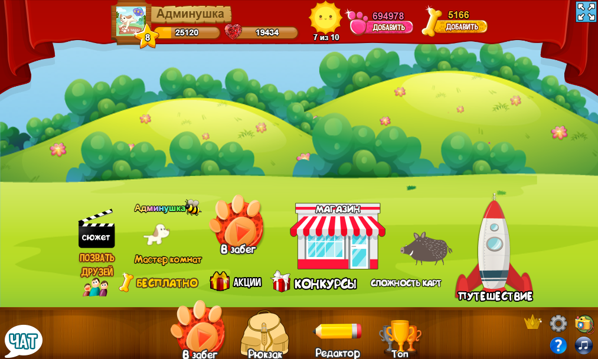

# Побег собачек (старая версия)

  

### Подготовка к установке
1: Скачайте zip архив проекта, можно по прямой ссылке https://github.com/animalsgame/dogsgame3/archive/refs/heads/main.zip и перенесите из архива папку `dogsgame3-main` в удобное место, например на диск C, важно чтобы не было русских букв в пути, иначе веб сервер или база данных могут не запуститься!
#### Переносить папку из архива обязательно, иначе дальнейшие шаги не помогут запустить игру!
2: Перейдите в папку `dogsgame3-main` и запустите файл `web.bat` (может называться `web`) при первом запуске могут появиться два окна брандмауэра windows, это открытие портов, нужно разрешить, если вы отмените хоть одно действие, или закроете окно через крестик, веб сервер может не заработать!  
Если всё хорошо, будут галочки рядом с Apache и Mysql
#### Теперь про важные кнопки 
`Root dir` домашняя папка веб сервера, то что будет доступно через адрес localhost (там находятся файлы для игры, упакованная графика, и сама игра, всё что нужно)  
`Localhost` откроет ссылку http://localhost в браузере.  
`PHPMyAdmin` это панель управления базой данных, она пока ещё пустая, для входа в панель нужен только логин `root` а пароль оставить пустым, там будет управление всеми игровыми данными.

### А теперь запуск!
1: Нажмите на кнопку `Localhost` или перейдите по ссылке http://localhost при первом входе будет долгая загрузка страницы, произойдёт создание базы данных для игры, это займёт секунд 5, после этого вы увидите игру которая не может подключиться к серверу.  
2: Запустите файл из папки `dogsgame3-main` файл `run.bat` (может называться `run`) мгновенно будет создана серверная часть игры из исходного кода, и произойдёт запуск сервера, теперь останется обновить вкладку с игрой, или нажать на кнопку чтобы переподключиться (в игре) если всё сделано правильно то игра заработает!  
### Доп. информация
Не смотря на то что это старая версия игры, код используется и в текущей версии, это настоящая серверная часть для пс, без неё игра бы не запустилась, некоторый код был удалён так как он нужен только в текущей версии.  
Чтобы работали аватарки в игре, нужен токен от любого созданного приложения вк, об этом чуть позже.  
Серверная часть с исходным кодом, находится в папке `src` а клиентская часть с максимально читаемым кодом [файл](webserver/root/dogsgame3/js/jUH83nOTLouz5HMtZurNDFBB8fMrki.js?raw=1) (много кода), но это не исходный код, даже если был бы исходный код, он не будет работать напрямую в браузере.

#### Как играть с разных страниц?
Для этого приготовлен файл `sign.php` прямая ссылка http://localhost/dogsgame3/sign.php?login= где после равно нужно ввести логин любой, если страница вк то логин vk и слитно id страницы вк, будет создана подпись для страницы, по умолчанию игра запускается с моим id вк  
Ссылка на запуск игры выглядит так http://localhost/dogsgame3/?key= где после равно вставьте ключ который получен через ссылку на `sign.php`

#### Инструкция может дополняться.
